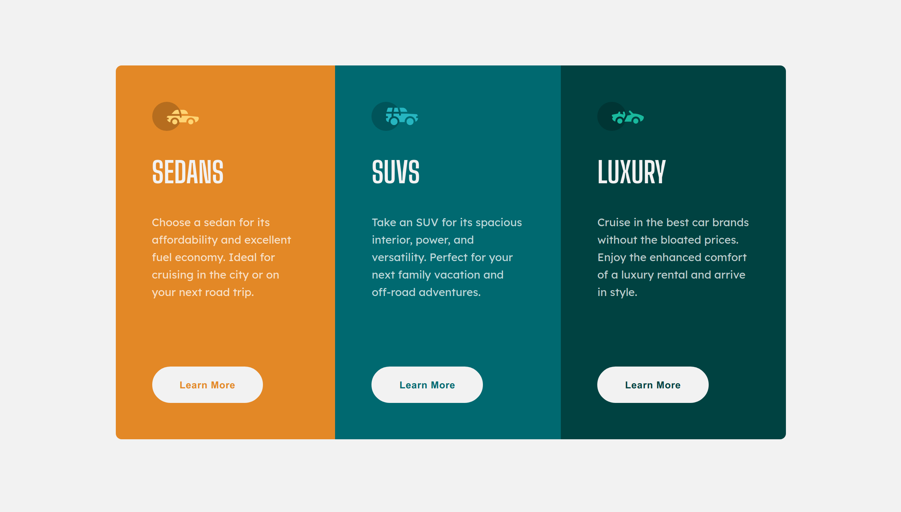

# Frontend Mentor - 3-column preview card component solution

This is a solution to the [3-column preview card component challenge on Frontend Mentor](https://www.frontendmentor.io/challenges/3column-preview-card-component-pH92eAR2-). Frontend Mentor challenges help you improve your coding skills by building realistic projects. 

## Table of contents

- [Overview](#overview)
  - [The challenge](#the-challenge)
  - [Screenshot](#screenshot)
  - [Links](#links)
- [My process](#my-process)
  - [Built with](#built-with)
  - [What I learned](#what-i-learned)
- [Author](#author)
- [Acknowledgments](#acknowledgments)

## Overview

### The challenge

Users should be able to:

- View the optimal layout depending on their device's screen size
- See hover states for interactive elements

### Screenshot



### Links

- [Solution URL](https://7mica.github.io/3-column-preview-card-component/)
- [Live Site URL](https://github.com/7Mica/3-column-preview-card-component)

## My process

### Built with

- Semantic HTML5 markup
- Vanilla CSS
- Flexbox
- Mobile-first workflow

### What I learned

What I learned?

- I learned that sometimes Chrome dev tools has some horrible bugs at the device toolbar.

- Add the border to the buttons at the initial style properties. Because if it's hovered, it will grow a with the borders.

✅:

```css
.btn {
  ...
  border: 2px hsl(0, 0%, 95%) solid;
}

.btn:hover {
  cursor: pointer;
  color: hsl(0, 0%, 95%)
}
```
❌:

```css
.btn {
  ...
}

.btn:hover {
  border: 2px hsl(0, 0%, 95%) solid;
  cursor: pointer;
  color: hsl(0, 0%, 95%)
}

```
## Author

- Frontend Mentor - [@t4k3r0](https://www.frontendmentor.io/profile/t4k3r0)
